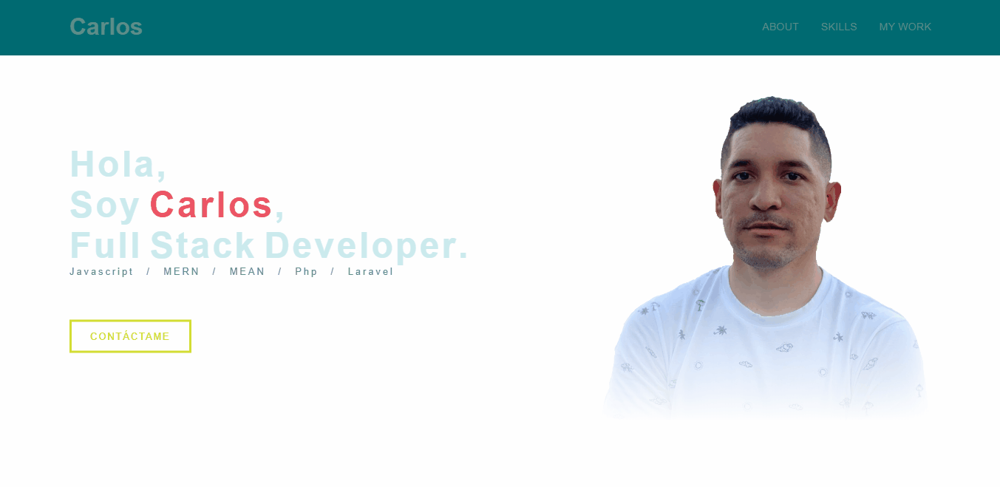

# website-personal :rocket:
*_Proyecto personal sobre mi portfolio en donde reuno mis proyectos, mi experiencia y donde pueden conocer un poco mas de mi perfil profesional._*

# Header :pencil:
*_Desde el header se puede explorar toda la app mediante las diferentes rutas que he establecido._*

  

# About :pencil:
*_En sobre mí, hablo un poco de mi pasado, presente y futuro. Las causas que me interesan._*

  

# Skills :pencil:
*_En esta sección muestro el stack tecnológico con que he venido trabajando como Desarrollador Full Stack._*

  

# My Work :pencil:
*_El apartado My work me sirve para mostrar mis proyectos, mi forma de trabajar._*

  

# Contact :pencil:
*_Con el uso de un formulario las personas interresadas pueden ponerse en contacto connmigo mediante mi email._*

  

# Footer :pencil:
*_Este espacio esta destinado a mis redes y a las cuales se pueden accer y seguirme._*

  

# Construido con 🛠️

* [Javascript](https://www.javascript.com/) - Lenguaje de programación para dar funcionalidad y manipular el DOM
* [Animate.css](https://animate.style/) - Biblioteca de animación.
* [Gsap](https://greensock.com/gsap/) - Animación Javascript para web.

